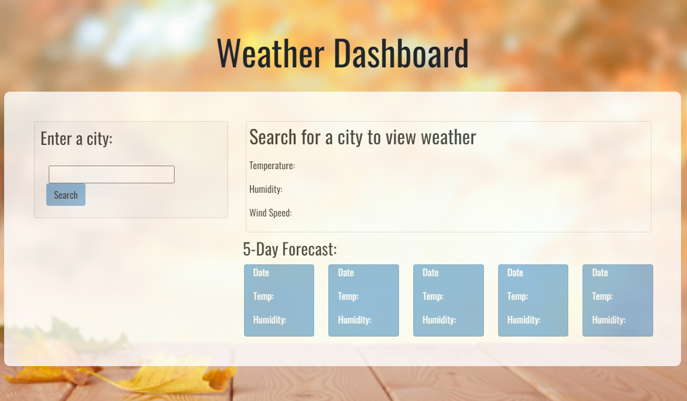

# Weather Dashboard

## Description
This dashboard is still in the works. The dashboard will be designed to show the current weather for the selected city along with a 5 day forecast.

## Technology Used

* HTML
* CSS 
* moment.js
* jQuery
* JavaScript
* Bootstrap

## Usage

When the user searches their destination city, the page will then load with the current weather information for that city. Below, the user will also be able to navigate through the next 5 days and what the forecasted weather is for their selected city. 

## Deployed URL
 <a href="https://jjohnson673.github.io/vigilant-fiesta/"
  target="_blank">Click here to go to the deployed site</a>

## Credits

N/A

## License

N/A

